# Syntax_SQL

### 이민아 


---

## Index


- [개념](#개념)
- [DDL](#DDL)
  - CREATE
    - TABLE
    - VIEW AS SELECT
  - ALTER
    - ADD
    - ALTER (MODIFY)
    - DROP COLUMN
  - DROP
    - TABLE
- [DCL](#DCL)
  - GRANT ON TO
  - REVOKE ON FROM
  - COMMIT
  - ROLLBACK
  - SAVEPOINT
- [DML](#DML)
  - SELECT FROM
  - INSERT INTO VALUES
  - DELETE FROM
  - UPDATE SET
- [JOIN](#JOIN)
- [절차형 SQL](#절차형-sql)
  - 트리거
  - 사용자 정의 함수
  - 커서
  - 프로시저
- [옵티마이저](#옵티마이저)
  - RBO
  - CBO


----

## 개념


### 1. SQL 유형

#### (1) 동적 SQL 

- 다양한 조건에 따라 **동적으로** 구문 변경하여 처리
- 사용자로부터 SQL문 **일부 또는 전부** 입력받아 실행
- 정적에 비해 속도가 느리지만 상황에 따른 **다양한 조건** 첨가 등 유연한 개발
- 조건에 따라 SQL 구문 자체 변경하고 조작 가능
- 개발 언어에 삽입되는 **SQL코드**를 문자열 **변수**에 넣어 처리하는 것

#### (2) 정적 SQL

- SQL 코드를 **변수에 담지 않고** 코드 사이에 **직접** 기술

#### (3) SQL 테스트

- 단문 SQL 
  - DDL, DML, DCL이 포함되어 있는 SQL과 TCL(Commit, Rollback, Savepoint)을 테스트
  - 직접 실행하여 결과물을 확인

- 절차형 SQL

  - **특정 사용자**가 **실행 순서**를 정해놓고 사용하는 SQL문

  - 프로시저, 사용자 정의 함수, 트리거 등의 절차형 SQL은 디버깅을 통해 기능의 적합성 여부를 검증하고, 실행을 통해 결과를 확인하는 테스트를 수행
  -  SHOW 명령어를 통해 오류 내용을 확인하고 문제를 수정

  - 유형

    - 트리거

    - 사용자 정의 함수

    - 커서

    - 프로시저


### 2. SQL 언어

- DDL 

  - DB 구조, 데이터 형식, 접근 방식 등 **DB 구축하거나 수정** 목적

  - **데이터 사전**이라는 특별한 파일에 여러 개의 테이블로서 저장
  
- DCL

  - 데이터 **보안, 무결성, 회복, 병행 제어** 등을 정의하는데 사용
  - 데이터베이스 **관리자**가 데이터 관리하는 목적
  
- DML

  - 데이터베이스 **사용자**가 응용 프로그램이나 질의어를 통해 저장된 데이터를 실질적으로 관리하는데 사용되는 언어
  
- JOIN


### 3. **SQL 힌트(HINT)** ★

- SQL 문에 **액서스 경로 및 조인 순서** 등의 정보를 **사전**에 주어서
- SQL 문 **실행에 빠른 결과**를 가져오는 효과를 만드는 기법


----

## DDL

> 데이터 정의어 (Data Define Language)


### 1. CREATE

#### (1) CREATE TABLE ★

> `CREATE TABLE 테이블명` 

- KEY

  - `PRIMARY KEY(속성명)` : 기본키 ★

  - `UNIQUE` : 대체키로 사용할 속성 또는 속성의 집합을 지정하는 것으로 중복된 값 가질 수 없다

  - `FOREIGN KEY(속성명) REFERENCES 테이블명(속성명)` ★
  - `ON DELETE` 옵션 : NO ACTION, CASCADE, SET NULL, SET DEFAULT
    
  - `ON UPDATE` 옵션 : NO ACTION, CASCADE, SET NULL, SET DEFAULT
- 제약조건

  - `CONSTRAINT` : 제약 조건의 이름 지정하며 이름 지정할 필요없으면 CHECK절만 사용
  - `CHECK` : 속성값 제약 조건 정의 ★
  - `IN`

- [input]

```sql
CREATE TABLE 교수
(	교수번호 NUMBER NOT NULL,
	교수명 CHAR(12),
	전공과목 CHAR(15) CHECK (전공과목 IN ('물리학', '심리학'))
 	-- CHECK IN 속성값 제약 조건
 	-- 전공과목의 속성값을 '물리학', '심리학'으로 제한
);
```

- [input]

```sql
CREATE TABLE Instructor
-- CREATE TABLE 테이블명
(	id CHAR(5),
 	-- 속성명 자료형 
 	name CHAR(15) NOT NULL,
 	-- 속성명 자료형 NOT NULL
 	dept CHAR(15),
 	-- 속성명 자료형 (외래키)
 	PRIMARY KEY(id),
 	-- 기본키 PRIMARY KEY(속성명)
 	FOREIGN KEY(dept) REFERENCES
 	-- 외래키 FOREIGN KEY(속성명) REFERENCES
 		Department(name)
 			ON DELETE SET NULL
 			-- 삭제되는 경우 ON DELETE
 			-- 관련된 모든 튜플의 속성값은 NULL (SET NULL)
 			ON UPDATE CASCADE
 			-- 변경되는 경우 ON UPDATE
 			-- 관련된 모든 속성값도 같은 값으로 변경(CASCADE)
);
```

#### (2) CREATE VIEW 

> `CREATE VIEW 뷰명`  `AS SELECT` 

- [input]

```sql
CREATE VIEW 출석부
-- CREATE VIEW 뷰명
AS SELECT 성명, 사진, 학년
-- AS SELECT 속성명
-- 서브쿼리
FROM 학생
-- FROM 테이블명
WHERE 학생=2;
-- WHERE 속성명 조건
-- UNION이나 ORDER BY 사용불가
```


### 2. ALTER / DROP

#### (1) ALTER TABLE ★

> `ALTER TABLE 테이블명`

- 속성
  - `ADD 속성명 자료형` 추가 ★
  - `ALTER | MODIFY 속성명 `  정의 변경
  - `DROP COLUMN 속성명 CASCADE` 삭제

- [input]

```sql
-- ALTER TABLE 테이블명 ADD 속성명 자료형
-- ALTER TABLE 테이블명 DROP COLUMN 속성명 CASCADE
-- ALTER TABLE 테이블명 ALTER | MODIFY 속성명
ALTER TABLE HRD ALTER 주민번호 NUMBER(6);
ALTER TABLE HRD MODIFY 주민번호 NUMBER(6);
-- HRD 테이블에서 주민번호의 속성의 크기를 6으로 변경
```

#### (2) DROP TABLE

> `DROP TABLE 테이블명`

- `CASCADE`  : 제거할 요소 참조하는 **모든** 개체 **함께 제거(참조 무결성** 제약 조건)
- `RESTRICTED`  : 다른 개체가 제거할 요소를 참조중인 경우 **제거 취소**

- [input]

```sql
-- DROP TABLE 테이블명 CASCADE
-- DROP TABLE 테이블명 RESTRICTED 
DROP TABLE 사원 CASCADE
-- 사원 테이블을 제거하고 참조하는 모든 데이터도 함께 제거
```


---

## DCL

> 데이터 제어어 (Data Control Language)


### 1. GRANT / REVOKE ★

#### (1) 사용자 등급 지정 및 해제

> `GRANT 사용자등급 TO 사용자_ID_리스트 ` , `REVOKE 사용자등급 FROM 사용자_ID_리스트 `

- [input]

```sql
GRANT INSERT ON 직원 TO 고길동;
-- 인사담당자 고길동에게 ‘직원’ 테이블에 대해 INSERT할 수 있는 권한을 부여
-- GRANT 사용자등급 ON 테이블명 TO 사용자_ID_리스트 
-- REVOKE 사용자등급 FROM 사용자_ID_리스트 
```

#### (2) 테이블 및 속성에 대한 권한 부여 및 취소 ★

- 권한 : `ALL`, `SELECT`, `INSERT`, `DELETE`, `UPDATE`, `ALTER` 등
- `GRANT` 
  - `WITH GRANT OPTION` : 부여받은 권한을 다른 사용자에게 **다시 부여**할 수 있는 권한
  - `ON 테이블명 TO 사용자`
- `REVOKE`
  - `GRANT OPTION FOR` : 다른 사용자에게 권한을 부여할 수 있는 권한을 취소
  - `CASCADE` : 권한 취소 시 권한 부여받았던 사용자가 부여한 권한도 **연쇄적 취소** ★
  - `ON 테이블명 FROM 사용자`

- [input]

```sql
-- GRANT 권한_리스트 ON 테이블명 TO 사용자 (WITH GRANT OPTION)
GRANT ALL ON 사원 TO 김영웅;
-- REVOKE (GRANT OPTION FOR) 권한_리스트 ON 테이블명 FROM 사용자 (CASCADE)
REVOKE SELECT, INSERT, DELETE ON 고객 FROM 이민지;
```


### 2. COMMIT / ROLLBACK / SAVEPOINT 

#### (1) COMMIT

- **트랜잭션이 성공적으로 끝나면** DB가 새로운 **일관성** 상태를 가지기 위해 변경된 **모든** 내용을 DB에 반영해야 하는 데 사용하는 명령

#### (2) ROLLBACK 

- **아직 COMMIT 되지 않은** 변경된 모든 내용들을 **취소하고** DB를 **이전** 상태로 되돌리는 명령어


#### (3) SAVEPOINT 

- 트랜잭션 내에서 **ROLLBACK할 위치인 저장점**을 지저하는 명령어
- 저장점을 지정할 때에는 **이름 부여**
- ROLLBACK시 지**정된 저장점까지 트랜잭션 처리 내용이 취소**
  - CHECKPOINT : 트랜잭션 저장하는 **시기 설정**


----

## DML

> 데이터 조작어 (Data Manipulation Language)


### 1. SELECT ★

#### (1) SELECT ★

> `SELECT (PREDICATE) (*|테이블명.)속성명 (AS 헤더) FROM 테이블명 `

- 속성명
  - `*` : 모든 속성
  - `테이블명.속성명` : 2개 이상의 테이블 대상으로 검색
  - `AS` : 테이블 헤더 이름 지정
-  PREDICATE : 불러올 튜플 수를 제한할 명령어
  - ALL
  - DISTINCT : 중복 튜플 존재 시 그중 첫번째만 검색
  - DISTINCTROW : 중복된 튜플 검색하지만 선택된 속성값이 아닌 튜플 전체 대상
  - UNION : 결과를 합칠때 **중복되는 행은 하나만 표시**
  - UNION ALL : 중복제거를 하지 않고 **모두 합쳐서**
- [input]

```sql
SELECT DISTINCT 학점 FROM 성적
-- DISTINCT 학점 속성의 중복제거 
-- 성적 테이블
```

- [input]

```sql
(SELECT DISTINCT A FROM X) UNION ALL (SELECT A FROM Y)
-- DISTINCT A의 중복제거 (TABLE X)
-- UNION ALL A의 합집합(중복제거하지 않고) (TABLE Y)
```

- [input]

```sql
CREATE TABLE TBB1 ( NAME VARCHAR2(20), AGE NUMBER(3) ); 
CREATE TABLE TBB2 ( NAME VARCHAR2(20), AGE NUMBER(3) );

INSERT INTO TBB1(NAME, AGE) VALUES('장씨', 30);
INSERT INTO TBB1(NAME, AGE) VALUES('마씨', 35);
INSERT INTO TBB1(NAME, AGE) VALUES('홍씨', 40);
INSERT INTO TBB1(NAME, AGE) VALUES('남씨', 40);
INSERT INTO TBB2(NAME, AGE) VALUES('장씨', 30);
INSERT INTO TBB2(NAME, AGE) VALUES('이씨', 50);
INSERT INTO TBB2(NAME, AGE) VALUES('최씨', 55);

SELECT * FROM TBB1
UNION
SELECT * FROM TBB2;
-- UNION A의 합집합(중복제거) 
```

#### (2) 조건 / 그룹 / 순서 / 개수 ★

> `FROM` `WHERE` `GROUP BY` `HAVING` `SELECT` `DISTINCT` `ORDER BY` `LIMIT`

- **조건 (WHERE)**
  - **LIKE**
    - % : 뒤에 1글자 이상 모두 가능
  - **BETWEEN AND**
- **그룹 (GROUP BY)**
  - HAVING : 그룹의 조건 
- 순서 (ORDER BY)
  - ASC|DESC : 생략하면 ASC 자동
- **개수 (LIMIT)**

- [input]

```sql
SELECT 이름
-- SELECT 속성
FROM 고객
-- FROM 테이블명
WHERE 나이 BETWEEN 40 AND 60
--  나이가 40살 이상이면서 60살 이하
AND 성별 = '남';
-- 성별이 남자
```

- [input]

```sql
SELECT 이름, 학년, 점수, 과목
-- SELECT 속성
FROM 학생
-- FROM 테이블명
WHERE 학년 IN (1, 4);
-- WHERE 속성 IN 값
```

- [input]

```sql
SELECT 팀명, 직급, SUM(성과급) AS 성과급
FROM 급여
-- FROM 급여 테이블
GROUP BY 팀명, 직급;
-- 팀과 직급별 성과급 합계를 구하는 쿼리
```

- [input]

```sql
SELECT 과목 COUNT(과목) AS 과목건수 
FROM 성적 
GROUP BY 과목;
```

- [input]

```sql
SELECT 과목 
FROM
( 
	SELECT 과목, COUNT(과목) 
	FROM 성적 
	GROUP BY 과목 
	HAVING COUNT(과목) > 1 
);
-- GROUP BY 속성명 HAVING 조건 
```

- [input]

```sql
SELECT 광역시, AVG(판매액) 
FROM 편의점
WHERE 판매액 > 1,000,000
GROUP BY 광역시
HAVING COUNT(*) >= 4;
-- GROUP BY 속성명 HAVING 조건 
```

- [input]

```sql
SELECT 이름, 급여 
-- 이름, 급여 속성
FROM 급여
-- 급여 테이블
WHERE 급여 > 4,500
-- 급여 4500만원 초과
ORDER BY 이름 DESC, 급여 DESC;
-- ORDER BY 속성명 (ASC|DESC)
```


#### (3) 집계 함수 / 그룹 함수 ★

- **집계 함수** : 여러 행과 테이블 전체로부터 **하나의 결과값 반환**

  - 일반적으로 **GROUP BY와 사용**

  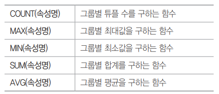

  - [input]

  ```sql
  SELECT COUNT(DISTINCT DEPT) FROM STUDENT WHERE DEPT='전산과';
  -- 전산과인 경우 DEPT를 중복 제거한 후 개수를 구하는 경우(1)
  ```

  - [input]

  ```sql
  SELECT 결제유형, COUNT(*) AS 입장객수 FROM 결제 GROUP BY 결제유형;
  -- 결제테이블을 이용해서 결제유형별 입장객수(별칭)를 검색
  ```

  

- **그룹 함수 ★** : 테이블의 전체행을 **하나이상의 컬럼**을 기준으로 **컬럼값에따라 그룹화**하여 **그룹별로 결과**
  
  - **ROLLUP** 
    - 소계, 중간 집계값 산출 ★
    - GROUP BY의 확장 형태로 사용하기 쉬운데, GROUP BY에 있는 항목들을 오른쪽에서 왼쪽순으로 그룹으로 묶어 집계
  - CUBE : 다차원 집계 생성
  - GROUPING SET : 컬럼에 대한 개별 집계
  - [input]
  
  ```sql
  SELECT 부서, 성과금등급, SUM(성과금) AS 성과금합계
  -- 성과금합계(별칭)
  FROM 성과금
  -- 성과금 테이블
  GROUP BY ROLLUP(부서, 성과금등급);
  -- '부서', '성과금등급', '성과금'에 대해서 부서별 소계와 전체 합계
  -- 우선순위 기준 부서 먼저 설정 후 성과금등급
  ```
  
- 윈도 함수 : DB 사용한 온라인 분석 처리 용도 사용하기 위해 SQL에 추가한 함수
  - 순위 함수
  - 행 순서 함수
  - 그룹 내 비율 함수

#### (4) 중복 조건 ★

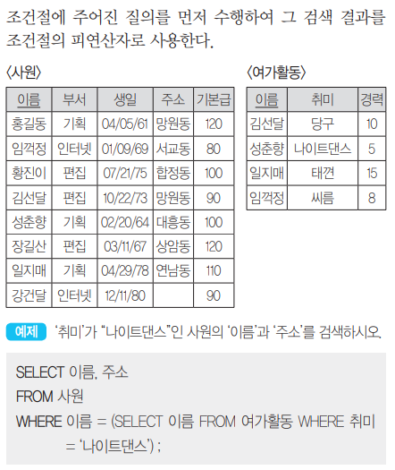

#### (5) 테이블 합치기 ★

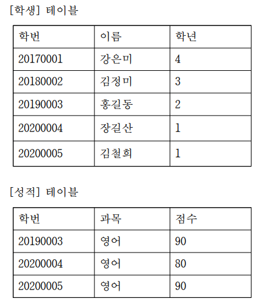

- [input]

```sql
SELECT SUM(점수) AS 점수
-- 합계
-- 점수(별칭)
FROM 성적 A, 학생 B
-- 2개의 테이블 
-- 테이블명 테이블대체명, 테이블명 테이블대체명
WHERE A.학번 = B.학번
-- 학생테이블의 학번과 성적테이블의 학번이 같고
AND B.학년 = '1';
-- 성적테이블의 학년이 1인 경우
```


### 2. INSERT ★

- [input]

```sql
INSERT INTO 성적(학번, 과목, 학점)
VALUES (1004,'파이썬', 'A');
INSERT INTO 성적
VALUES (1004,'파이썬', 'A');
-- INSERT INTO 테이블명(속성명1, 속성명2) VALUES (값1, 값2);
-- 모든 필드의 순서대로 다 입력한 경우 INTO에 TABLE만 입력
```


### 3. DELETE ★

- [input]

```sql
DELETE FROM 사원 WHERE 이름='홍길동'; 
-- DELETE FROM 테이블명 WHERE 조건; 
```


### 4. UPDATE ★

- [input]

```sql
UPDATE 학과 SET 학과번호=777 WHERE 교수명 LIKE '황%';
-- LIKE '황%' 황으로 시작하는 모든 값 조회
UPDATE 고객 SET 등급='VIP' WHERE 구매금액 >= 10000;
-- UPDATE 테이블명 SET 속성명='값' WHERE 조건;
```


-----

## JOIN


### 1. JOIN 

#### (1) 정의

- 2개의 테이블에 대해 연관된 튜플들을 결합하여 하나의 새로운 릴레이션

#### (2) 유형

- INNER JOIN(교집합)

  > 관계가 설정된 두 테이블에서 조인된 필드가 일치하는 행만 표시

  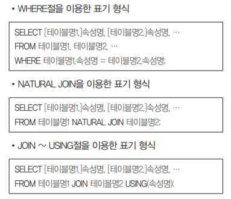

- OUTER JOIN(합집합)

  - **LEFT JOIN(부분집합)** 

    > INNER JOIN 조건에 만족하지 않는 튜플들에 NULL값 붙여 추가

    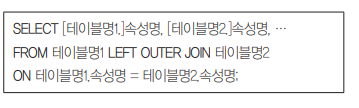

    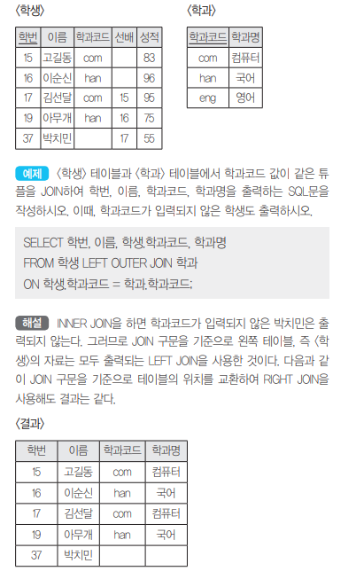

  - **RIGHT JOIN(부분집합)**

    


### 2. 문제 (Programmers) 

#### (1) 없어진 기록 찾기

- [input]

```sql
SELECT OUTTABLE.ANIMAL_ID, OUTTABLE.NAME
-- ID와 이름
-- A.FIELD1, A.FILED2
FROM ANIMAL_OUTS OUTTABLE LEFT JOIN ANIMAL_INS INTABLE 
-- FROM A_TABLE A OO JOIN B_TABLE B
ON OUTTABLE.ANIMAL_ID = INTABLE.ANIMAL_ID
-- ON A.KEY = B.KEY
-- 입양을 간 기록은 있고 (ANIMAL_OUTS)
WHERE INTABLE.ANIMAL_ID IS NULL
-- WHERE B.KEY IS NULL(A, B 교집합 제외 A-B)
-- 보호소에 들어온 기록이 없는 동물(ANIMAL_INS)
ORDER BY ANIMAL_ID
-- ID 순으로 조회
```

#### (2) 보호소에서 중성화한 동물 

- [input]

```sql
SELECT A.ANIMAL_ID, A.ANIMAL_TYPE , A.NAME
-- 동물의 아이디와 생물 종, 이름을 조회
FROM ANIMAL_INS A LEFT JOIN ANIMAL_OUTS B
ON A.ANIMAL_ID = B.ANIMAL_ID
-- ANIMAL_OUTS 테이블의 ANIMAL_ID는 ANIMAL_INS의 ANIMAL_ID의 외래 키
WHERE A.SEX_UPON_INTAKE LIKE 'Intact%' 
AND B.SEX_UPON_OUTCOME NOT LIKE 'Intact%'
-- 보호소에 들어올 당시에는 중성화(SEX_UPON_INTAKE)X
-- 보호소를 나갈 당시에는 중성화(SEX_UPON_OUTCOME)O
ORDER BY A.ANIMAL_ID
-- 아이디 순으로 조회
```

#### (3) 오랜기간 보호한 동물(1)

- [input]

```sql
SELECT A.NAME, A.DATETIME
-- 이름과 보호 시작일
FROM ANIMAL_INS A LEFT JOIN ANIMAL_OUTS B
ON A.ANIMAL_ID = B.ANIMAL_ID
-- ANIMAL_OUTS 테이블의 ANIMAL_ID는 ANIMAL_INS의 ANIMAL_ID의 외래 키
WHERE B.ANIMAL_ID IS NULL
-- 아직 입양을 못 간 동물 중(ANIMAL_OUTS에 없는 경우)
ORDER BY A.DATETIME
-- 보호 시작일 순으로 조회
LIMIT 3
-- 가장 오래 보호소에 있었던 동물 3마리
```

#### (4) 있었는데요 없었습니다

- [input]

```sql
SELECT A.ANIMAL_ID, A.NAME
-- 아이디와 이름을 조회
FROM ANIMAL_INS A LEFT JOIN ANIMAL_OUTS B
-- LEFT JOIN 
ON A.ANIMAL_ID = B.ANIMAL_ID
-- ANIMAL_OUTS 테이블의 ANIMAL_ID는 ANIMAL_INS의 ANIMAL_ID의 외래 키
WHERE A.DATETIME > B.DATETIME
-- 보호 시작일(A.DATETIME)보다 입양일(B.DATETIME)이 더 빠른 동물
ORDER BY A.DATETIME
-- 보호 시작일이 빠른 순으로 조회
```


-----------

## 절차형 SQL

> **특정 사용자**가 **실행 순서**를 정해놓고 사용하는 SQL문


### 1. 트리거 ★

#### (1) 정의  ★

- DB 시스템에서 **삽입, 갱신, 삭제 등의 이벤트**가 발생할때마다 관련 작업이 자동으로 수행되는 **절차형 SQL**
- DB에 저장되며 데이터 변경 및 무결성 유지, 로그 메시지 출력 등의 목적으로 사용

#### (2) 구성도 

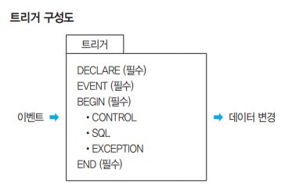

#### (3) 명령어

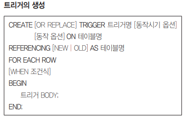

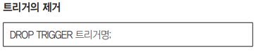

#### (4) 유형

- 행 트리거 : 데이터 변환시 실행
- 문장 트리거 : 트리거에 의해 한 번 실행


### 2. 사용자 정의 함수 

#### (1) 정의 

- **프로시저와 유사하게** SQL을 사용하여 **일련의 작업을 연속적**으로 처리하며 종료시 처리 결과를 **단일값으로 반환**하는 **절차형 SQL**
- 조회, 삽입, 삭제, 수정 등 **DML 문의 호출**에 의해 실행
- 예약어 **RETURN을 통해 값을 반환**하여 출력 파라미터가 없다

#### (2) 구성도 

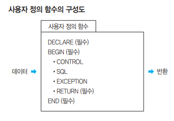

#### (3) 명령어

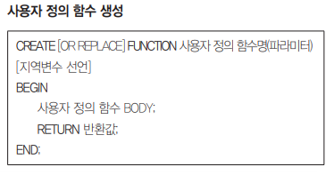

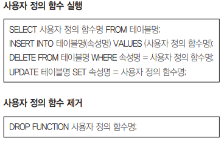


### 3. 커서

#### (1) 정의

- 쿼리문의 처리 결과가 저장되어 있는 **메모리 공간을 카리키는 포인터**
- 내부에서 자동 생성 혹은 사용자가 직접 정의해서 사용
- 수행 : (선언/명시적 커서) 열기 → 패치 → 닫기 

#### (2) 속성 

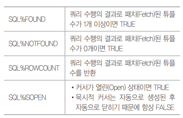

#### (3) 유형

- 묵시적 커서

  - **DBMS에서 자체적으로** 열리고 패치되어 사용이 끝나면 닫힌다
  - 커서의 속성을 조회하여 쿼리 정보 열람 가능

- 명시적 커서 

  - 사용자가 **직접 정의**해서 사용하는 커서

  - 절차형 SQL에서 SELECT 문의 결과로 반환되는 여러 튜플들 제어
  - 3단계 열기 패치 닫기 전에 **선언 필수**


### 4. 프로시저

#### (1) 정의 ★

- 일련의 **SQL쿼리의 집합**으로 마치 **하나의 함수처럼 실행**하여 **데이터를 조작**
- **절차형 SQL**을 활용하여 특정 기능을 수행하는 일종의 **트랜잭션** 언어
- 호출을 통해 실행되어 미리 저장해 놓은 SQL 작업 실행
- DB에 저장되어 수행되어 **스토어드 프로시저(Stored Procedure)**
- 시스템의 일일 마감작업, 일괄(Batch) 작업 등에 사용

####  (2) 유형 ★

- **PL/SQL** : **표준** SQL기반으로 **Oracle에서 개발**한 데이터 조작언어

- **JDBC  (Java DataBase Connectivity)** 

  **Java 언어로 다양한** 종류의 DB에 접속하고 SQL문 수행할 때 **표준 API**

#### (3) 구성도 

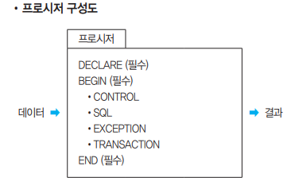

#### (4) 프로시저 명령어

- CREATE
- REPLACE

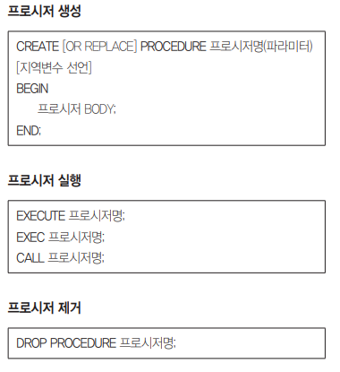

---

## 옵타마이저


### 1. 정의

> SQL을 가장 빠르고 효율적으로 수행할 수 있는 **최적의 경로**


### 2. 유형

#### (1) **RBO (Rule)**

- 규칙 기반 옵티마이저 

#### (2) **CBO (Cost)** 

- 비용 기반 옵티마이저


---

## References


- 시나공 정보처리기사 실기 대비용 핵심요약
- Programmers 문제풀이


---

